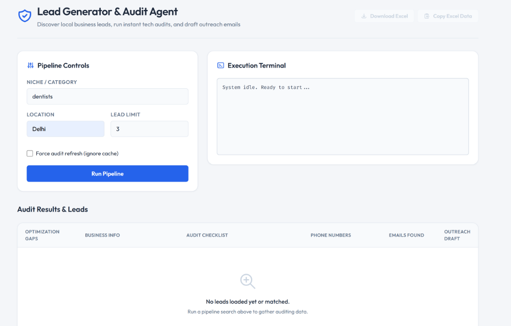
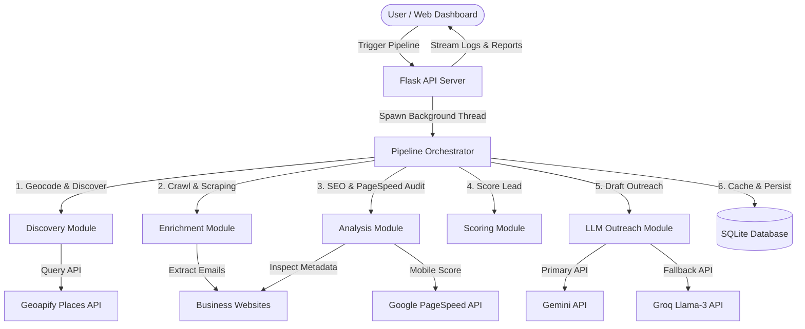

# Local Lead Generation & SEO Audit Agent

A production-grade Python-based autonomous agent designed to streamline lead prospecting for digital marketing agencies. The system finds local businesses using geolocation APIs, crawls their websites to extract direct contact information, runs a comprehensive technical and SEO audit, and drafts highly tailored cold outreach emails utilizing LLMs with built-in API rate-limit fallback.

### Live Deployment
*   **Web Dashboard:** [leadgenerator-backend-pzyw.onrender.com](https://leadgenerator-backend-pzyw.onrender.com)

---

### Dashboard Interface



---

### System Architecture



---

### Core Features

*   **Targeted Place Discovery:** Resolves textual locations to geographical coordinates, locating businesses in a 10km radius using the Geoapify Places and Place Details APIs.
*   **Polite Scraper Engine:** Inspects and complies with robots.txt, maps candidate links (e.g., /about, /contact), applies randomized request delays, and uses modern User-Agents to reliably extract email addresses.
*   **SEO & Speed Audit:** Checks SSL validity, SEO meta titles/descriptions, Google Analytics scripts, XML sitemaps, and runs mobile performance checks using the Google PageSpeed Insights API.
*   **Prioritization Engine:** Ranks leads out of 100 points, subtracting penalties for SEO and performance deficiencies to surface the highest-value clients.
*   **Dual-LLM Resiliency:** Drafts personalized cold emails targeting the top two audited website problems using Gemini, auto-falling back to Groq (Llama-3) or static templating to ensure system uptime.
*   **Asynchronous Processing Dashboard:** Real-time log streaming from a background execution thread to a frontend web console, with instant pipeline cancel controls.
*   **Data Export:** Formats and downloads lead lists directly to styled Excel spreadsheets (via Pandas & OpenPyXL) or raw CSVs.

---

### Engineering Decisions & Challenges

#### 1. Polite & Safe Web Crawling
Web scrapers routinely face blocking, IP bans, or SSL failures. The scraper module:
*   Queries `robots.txt` dynamically and caches the parsed directives to limit repeated server queries.
*   Applies a random politeness delay (1.0 to 3.0 seconds) between requests.
*   Uses regex-based filtering to clean found emails and discard asset false-positives (like `.png`, `.jpg`, `.css` filenames).

#### 2. Thread-Safe Live Log Streaming
Streaming real-time execution logs from a long-running background thread to a stateless HTTP API without blocking the main event loop required:
*   A custom thread-safe `InMemoryLogHandler` extending Python's native `logging.Handler`.
*   An atomic integer index tracker enabling the frontend to fetch only the newest log lines since its last request.
*   A shared atomic cancellation event checkable at every execution stage.

#### 3. Graceful LLM Failover
To protect against API quota limits or service outages:
*   The email generator implements a tier-based cascade: primary API (`gemini-2.5-flash`) -> fallback API (`llama-3.1-8b-instant` via Groq) -> structured static templates.
*   Errors are caught internally and logged without terminating the audit pipeline.

---

### Tech Stack

*   **Backend:** Python 3, Flask, Flask-CORS, Gunicorn, SQLite3
*   **Scraping & Data:** BeautifulSoup4, Requests, Pandas, OpenPyXL
*   **Integrations:** Geoapify API, Google PageSpeed Insights API, Google Gemini SDK, Groq SDK
*   **Frontend:** HTML5, Vanilla JavaScript, Custom CSS Variables

---

### Folder Structure

*   [app.py](file:///c:/Users/Mohit/Desktop/Devlopment/agents/Lead%20Generator%20Agent/app.py) - Flask API entry point and thread management.
*   `lead_gen_agent/` - Python application module.
    *   [pipeline.py](file:///c:/Users/Mohit/Desktop/Devlopment/agents/Lead%20Generator%20Agent/lead_gen_agent/pipeline.py) - Pipeline orchestrator and workflow state machine.
    *   [discovery.py](file:///c:/Users/Mohit/Desktop/Devlopment/agents/Lead%20Generator%20Agent/lead_gen_agent/discovery.py) - Location geocoding and Geoapify queries.
    *   [enrichment.py](file:///c:/Users/Mohit/Desktop/Devlopment/agents/Lead%20Generator%20Agent/lead_gen_agent/enrichment.py) - Web crawler and regex email parser.
    *   [analysis.py](file:///c:/Users/Mohit/Desktop/Devlopment/agents/Lead%20Generator%20Agent/lead_gen_agent/analysis.py) - Technical auditing and PageSpeed API integration.
    *   [scoring.py](file:///c:/Users/Mohit/Desktop/Devlopment/agents/Lead%20Generator%20Agent/lead_gen_agent/scoring.py) - Prioritization math scoring logic.
    *   [outreach.py](file:///c:/Users/Mohit/Desktop/Devlopment/agents/Lead%20Generator%20Agent/lead_gen_agent/outreach.py) - Cold email copywriter and API fallback cascade.
    *   [storage.py](file:///c:/Users/Mohit/Desktop/Devlopment/agents/Lead%20Generator%20Agent/lead_gen_agent/storage.py) - SQLite schema operations and query filters.
    *   [config.py](file:///c:/Users/Mohit/Desktop/Devlopment/agents/Lead%20Generator%20Agent/lead_gen_agent/config.py) - Global log settings and API client configurations.
*   `templates/` - Frontend views directory.
    *   [index.html](file:///c:/Users/Mohit/Desktop/Devlopment/agents/Lead%20Generator%20Agent/templates/index.html) - Fully stylized dashboard console UI.
*   `assets/` - Static media files.
    *   [dashboard_screenshot.png](file:///c:/Users/Mohit/Desktop/Devlopment/agents/Lead%20Generator%20Agent/assets/dashboard_screenshot.png) - Application screenshot.
*   [requirements.txt](file:///c:/Users/Mohit/Desktop/Devlopment/agents/Lead%20Generator%20Agent/requirements.txt) - Production environment requirements.
*   [.env.example](file:///c:/Users/Mohit/Desktop/Devlopment/agents/Lead%20Generator%20Agent/.env.example) - Template file containing environmental key configurations.

---

### Installation & Local Setup

#### Prerequisites
*   Python 3.8 or higher
*   Geoapify API key (free tier)
*   Google Gemini / Groq API keys

#### 1. Clone & Set Up Dependencies
```bash
git clone https://github.com/MohitPant2803/LeadGenerator-Backend.git
cd LeadGenerator-Backend
pip install -r requirements.txt
```

#### 2. Configure Environment Variables
Create a `.env` file in the root folder using the template:
```bash
cp .env.example .env
```
Fill in the API keys:
```env
GEOAPIFY_API_KEY=your_geoapify_key
PAGESPEED_API_KEY=your_google_pagespeed_key_optional
GEMINI_API_KEY=your_gemini_key_here
GROQ_API_KEY=your_groq_key_here
```

#### 3. Run via CLI
To perform searches directly from your terminal:
```bash
python lead_gen_agent/pipeline.py --niche "dentists" --location "Dallas, TX" --limit 5
```

#### 4. Run the Web Server Locally
```bash
python app.py
```
Open your browser and navigate to `http://localhost:5001` to access the interactive dashboard.
